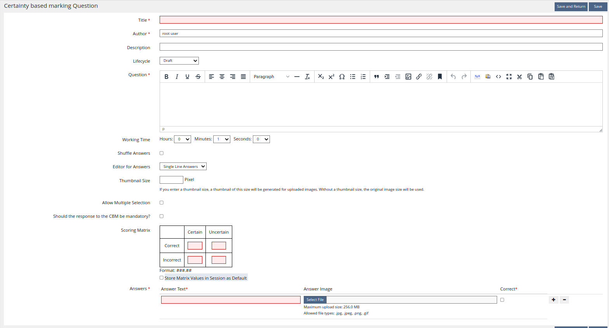
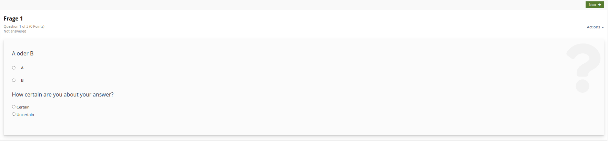

# Question Plugin - CBMChoiceQuestion

## Requirements

| Component                                     | Version(s)                                                                                           | Link                                                           |
|-----------------------------------------------|------------------------------------------------------------------------------------------------------|----------------------------------------------------------------|
| PHP                                           |          | [PHP](https://php.net)                                         |
| ILIAS                                         |  to  | [ILIAS](https://ilias.de)                                      |
| CBMChoiceQuestionExport (optional for export) |                                                         | [GitHub](https://github.com/DatabayAG/CBMChoiceQuestionExport) |

---
## Table of contents

<!-- TOC -->
* [Question Plugin - CBMChoiceQuestion](#question-plugin---cbmchoicequestion)
  * [Requirements](#requirements)
  * [Table of contents](#table-of-contents)
  * [Concept document](#concept-document)
  * [Information](#information)
  * [Installation](#installation)
  * [Usage](#usage)
<!-- TOC -->

---

## Concept document

[Concept document](docs/Konzept%20CBM-Fragetyp-Plugin.pdf)

## Information

The **CBMChoiceQuestionExport** plugin can optionally be used to export CBM Question Solutions into an Excel table format.

## Installation

1. Clone this repository to **Customizing/global/plugins/Modules/TestQuestionPool/Questions/CBMChoiceQuestion**
2. Install the Composer dependencies
   ```bash
   cd Customizing/global/plugins/Modules/TestQuestionPool/Questions/CBMChoiceQuestion
   composer install --no-dev
   ```
   Developers **MUST** omit the `--no-dev` argument.


3. Login to ILIAS with an administrator account (e.g. root)
4. Select **Plugins** in **Extending ILIAS** inside the **Administration** main menu.
5. Search for the **CBMChoiceQuestion** plugin in the list of plugin and choose **Install** from the **Actions** drop-down.
6. Choose **Activate** from the **Actions** dropdown.

## Usage

1. Create a Test Object somewhere in ILIAS
2. Open the **Questions** tab and click on **Create Question**
3. Select ``Certainty based marking Question`` as the Question Type.
4. Configure the question like a normal test.
   - If ``Editor for Answers`` is set you can use a rich text editor for the question text (after saving once)
   - ``Thumbnail Size`` changes the width & height of images uploaded in the `Single Line Answers` mode.
   - ``Allow Multiple Selection`` changes the question into a Multi select question (multiple answers can be ticked).
   - If ``Should the response to the CBM be mandatory`` is enabled, not filling out the certainty below the question will result in 0 points given.
   - The ``Scoring Matrix`` defines how many points the participant receives for the chosen answer/certainty.
   - The ``Store Matrix Values in Session as Default`` checkbox stores the choosen ``Scoring Matrix`` in the session. If you create another question, the values will be automatically filled.
   

5. Start the test and answer the question
